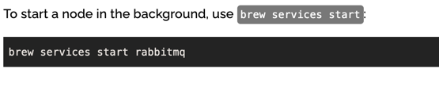

프로젝트 실행을 위한 단계입니다 안되는거 궁금한거 있으면
깃헙에서 이슈 열어서 말해주시고
아래 단계를 따라가기 힘들다면 말해주시면 도커파일 만들겠습니다

래빗MQ 설치 및 실행한 후 백엔드 서버 실행해주세요

RabbitMQ(메시지 브로커) 설치
인터넷에서 나온대로 그냥 설치해주시면 됩니다~~ 
맥 homebrew로 설치시 아래 링크 참고
[RabbitMQ installation - homebrew](https://www.rabbitmq.com/install-homebrew.html)

설치하고 나면 아래와 같이 실행해줍니다

프로젝트 처음 실행하기 전에 프로젝트 SDK 설정하라는 문구 나오면 자바17 선택
프로젝트 SDK 설정 되고나서 콘솔에 뭐 이것저것 써지는거 멈춰지고 나면 아래처럼 DemoApplication이 초록색 화살표 옆에 뜨는게 정상입니다!
초록색 화살표 클릭해서 백엔드 서버 실행하세요

인텔리J에서 실행할 때 기준!!
여기서는 sockJS 사용 불가능

위 처럼 설정되어있는지(자바17) 확인

위 처럼 설정되어있는지(자바17) 확인

그리고 프론트는 .. 잘 알고 계실테니 생략!!!

이미 만들어진 채팅창 다른 브라우저에서 접속해보기

다른 브라우저에서 접속한 유저가 채팅하는 것을 확인 가능